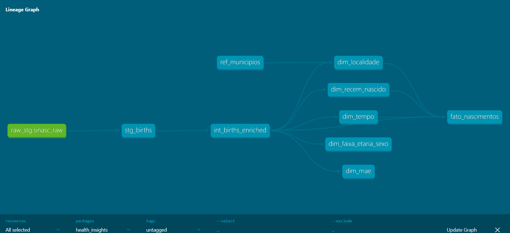

# Health Insights — SINASC (Nascimentos)

**Objetivo** 

Este repositório demonstra o desenho e a implementação de uma pipeline de dados completa para o conjunto de dados SINASC (Sistema de Informações sobre Nascidos Vivos), disponibilizado pelo portal oficial do DataSUS. O objetivo é ingerir, transformar, modelar e expor dados brutos de saúde pública, através da simulação de uma solução de engenharia de dados de ponta a ponta. Todas as etapas foram pensadas para refletir boas práticas de engenharia, desde a recolha até à visualização.

## 0) Estrutura de pastas do projeto

O projeto foi organizado para que cada componente da pipeline tenha o seu lugar. A árvore de diretórios abaixo resume a estrutura utilizada:

```bash
health_insights/
├─ datasets/
│  ├─ originais/        # .dbc baixados do DATASUS (ex.: DNRJ2022.dbc, DNRJ2023.dbc)
│  └─ csv/              # CSVs convertidos (camada bronze do data lake)
├─ scripts/
│  └─ converter_dbc_para_csv.py     # script de conversão Python
├─ app/
│  └─ hi_dashboard_3in1.py            # dashboard Streamlit
├─ images/
└─ dbt/health_insights/
   ├─ dbt_project.yml
   ├─ macro/
   │   └─ pick_col.sql
   ├─ seeds/
   │   ├─ refs/
   │   │  └─ ref_municipios.csv
   │   └─ schema.yml
   ├─ models/
   │   ├─ databricks/
   │   │  ├─ check_conn.sql
   │   │  ├─ fed_fato.sql
   │   │  └─ fed_kpis.sql
   │   ├─ staging/
   │   │  ├─ stg_births.sql
   │   │  └─ stg_births.yml
   │   ├─ intermediate/
   │   │  └─ int_births_enriched.sql
   │   ├─ marts/
   │   │   ├─ dim_faixa_etaria_sexo.sql
   │   │   ├─ dim_localidade.sql
   │   │   ├─ dim_mae.sql
   │   │   ├─ dim_recem_nascido.sql
   │   │   ├─ dim_tempo.sql
   │   │   ├─ fato_nascimentos.sql
   │   │   └─ marts.yml
   │   └─ sources.yml
   ├─ dbt_project.yml
   └─ packages.yml
```
> **Nota:** Os diretórios datasets/originais e datasets/csv simulam, respectivamente, a camada de ingestão (landing) e a camada bronze de um data lake. Em ambientes de produção estes ficheiros estariam num armazenamento de objetos (por exemplo S3, Azure Blob ou GCS) e seriam divididos de acordo com o período de recolha.

## 1) Coleta e Ingestão de Dados

### Fonte de dados

Os dados utilizados são de acesso público, obtidos no portal oficial do DataSUS na área de Transferência de Arquivos (ftp.datasus.gov.br), especificamente do conjunto SINASC – Sistema de Informações sobre Nascidos Vivos.
O download foi realizado em 13/08/2025 (Europe/Lisbon), contemplando os ficheiros referentes ao estado do Rio de Janeiro (RJ) para os anos de 2022 e 2023.
A escolha do SINASC deve-se à sua relevância para a saúde pública, permitindo análises consistentes sobre nascimentos e perfil materno-infantil em um período recente.

### Simulação de Data Lake / Camada Bronze
Os ficheiros originais no formato .DBC foram descarregados para o diretório datasets/originais/ e convertidos para .CSV utilizando o script Python scripts/converter_dbc_para_csv.py.
Os arquivos convertidos foram armazenados em datasets/csv/, representando a camada bronze da arquitetura.
Em um cenário real, esta camada corresponderia ao armazenamento inicial em um data lake (por exemplo, arquivos Parquet no Amazon S3, Azure Data Lake ou Google Cloud Storage), preservando os dados brutos antes de qualquer transformação.

### Ingestão no Snowflake
Após a conversão, os CSVs foram ingeridos no Snowflake seguindo estes passos:

1. Criação da database, schemas e warehouse dedicados ao projeto.
2. Definição de um file format do tipo CSV com HEADER=TRUE.
3. Criação de um stage (RAW_STAGE) para upload dos CSVs via Snowsight.
4. Inferência automática de schema e criação da tabela RAW_STG.SINASC_RAW com base nos CSVs.
5. Execução do comando COPY INTO para carregar os ficheiros convertidos (ex.: dnrj2022.csv, dnrj2023.csv) para a tabela.

Com isso, o processo de ingestão foi comprovadamente executado na plataforma-alvo, simulando um fluxo real de recolha e armazenamento inicial de dados em ambiente de nuvem.

## 2) Transformação e Modelagem de Dados com dbt

### Objetivo
Transformar os dados brutos do DataSUS em um modelo dimensional no formato Star Schema, pronto para análise em saúde pública.  
O processo foi feito integralmente com o dbt, através da organização e transformação em camadas, criação de tabelas de fato e de dimensão, implementação de testes de qualidade e documentação.

### Modelagem Dimensional
O modelo foi desenhado em Star Schema, com uma tabela fato central (`fato_nascimentos`) conectada a várias dimensões que permitem análises geográficas, temporais, demográficas e clínicas.

**Tabelas criadas:**

| Tabela                  | Tipo      | Descrição resumida |
|-------------------------|-----------|--------------------|
| `fato_nascimentos`      | Fato      | Registra cada nascimento com chaves para as dimensões e medidas como peso do bebê, idade gestacional, tipo de parto, flag de prematuridade, número de consultas pré-natal e indicadores de vitalidade do recém-nascido. |
| `dim_tempo`             | Dimensão  | Calendário com dia, mês, trimestre, ano, dia da semana; permite análises temporais. |
| `dim_localidade`        | Dimensão  | Códigos de município, UF e região; permite análises geográficas. |
| `dim_faixa_etaria_sexo` | Dimensão  | Faixa etária da mãe e sexo do recém-nascido, permitindo cruzar fatores demográficos. |
| `dim_mae`               | Dimensão  | Atributos da mãe: escolaridade, estado civil, raça/cor, número de filhos, entre outros. |
| `dim_recem_nascido`     | Dimensão  | Características do recém-nascido, como sexo, peso ao nascer, Apgar no 1º e 5º minuto, e presença de anomalias congênitas. |

**Chaves:**
- Cada dimensão possui surrogate key (chave substituta).
- A fato referencia essas chaves e inclui métricas numéricas e indicadores binários, como:
  - `peso_ao_nascer`
  - `idade_gestacional`
  - `quantidade_consultas_pre_natal`
  - `flag_parto_cesario`
  - `flag_prematuro`
  - `apgar1`
  - `apgar5`

### Estrutura em Camadas no dbt

1. **Staging (`models/staging/`)**
   - Normaliza e padroniza os dados brutos.
   - Ex.: `stg_births.sql` trata diferenças de schema entre anos, padroniza datas (`try_to_date`) e converte códigos para tipos adequados.
   - **Materialização:** `view` (mais rápido e fácil de inspecionar).
   
   **Comando:**
   ```bash
   dbt run -s staging
   ```

2. **Intermediate (`models/intermediate/`)**
   - Enriquece e junta tabelas de staging.
   - Ex.: `int_births_enriched.sql` une dados de nascimentos com códigos de localidade, atributos da mãe e informações do recém-nascido.
   - **Materialização:** `view` ou `table` dependendo do caso.

   **Comando:**
   ```bash
   dbt run -s intermediate
   ```

3. **Marts (`models/marts/`)**
   - Contém tabelas **fato** e **dimensões** finais.
   - `fato_nascimentos.sql` é **incremental** para otimizar a carga de grandes volumes.
   - Dimensões (`dim_*.sql`) são materializadas como `table` (pequenas e estáveis).

   **Comando:**
   ```bash
   dbt run -s marts
   ```

### Testes de Qualidade no dbt
Foram definidos testes e SQL para garantir a integridade dos dados.

Tipos de testes aplicados:
- **Unique:** garante que IDs de dimensões são únicos.
- **Not Null:** campos críticos (datas, município, sexo).
- **Accepted Values:** validação de códigos do DataSUS (ex.: sexo ∈ {1, 2}).
- **Referential Integrity:** chaves estrangeiras da fato devem existir nas dimensões.

**Comando para executar todos os testes:**
   ```bash
   dbt test
   ```

**Comando para executar testes de um modelo específico:**
   ```bash
   dbt test -m fato_nascimentos
   ```

### Documentação
Foi gerada documentação dos modelos usando:

**Comando:**
   ```bash
   dbt docs generate
   dbt docs serve
   ```

**Isto permite consultar:**
- Descrições das tabelas e colunas
- Relações entre modelos
- Histórico de execuções.

### Execução Completa
Para rodar toda a pipeline de transformação e modelagem de dados:
1. Executa todos os modelos
   ```bash
   dbt run
   ```
2. Executa todos os testes
   ```bash
   dbt test
   ```
3. Gera e abre documentação
   ```bash
   dbt docs generate
   dbt docs serve
   ```

### Linha de Dependência (Lineage Graph)

A imagem abaixo apresenta o grafo de dependência dos modelos no dbt, evidenciando a sequência de transformações e relações entre tabelas.



## 3) Escolha da Plataforma + Bónus

O projeto utiliza o Snowflake como Data Warehouse principal para ingestão, modelagem e consumo dos dados, complementado pelo Databricks para demonstrar interoperabilidade entre plataformas.

**Justificação da escolha do Snowflake:**
1. **Escalabilidade elástica** — permite ajustar computação e armazenamento de forma independente, adaptando o warehouse (BOOTCAMP_WH) ao volume de dados e complexidade das consultas.
2. **Recursos avançados de gestão** — Time Travel e Zero-Copy Cloning possibilitam versionamento e recuperação de dados, facilitando testes e auditorias sem duplicação física.
3. **Integração otimizada com dbt** — o adaptador dbt-snowflake permite executar modelos, testes e documentação diretamente no Snowflake, com materializações eficientes.
4. **Ingestão simplificada** — stages internos e comandos COPY INTO aceleram o carregamento de CSVs, reduzindo overhead e complexidade.

### Arquitetura Híbrida

Além do pipeline completo no Snowflake, foi configurada uma integração simples entre Databricks ↔ Snowflake para leitura e comparação de dados:

1. **Lakehouse Federation (Snowflake → Databricks)**
- Criação de CONNECTION e FOREIGN CATALOG no Databricks para o banco HEALTH_INSIGHTS do Snowflake.
- Permite consultar dimensões e fatos diretamente no Databricks sem exportar ficheiros.
- Exemplo:
   ```sql
   SHOW SCHEMAS IN CATALOG sf_hi;
   SELECT COUNT(*) FROM sf_hi.raw_stg_marts.fato_nascimentos;
   ```

2. **Snapshot para Delta (Databricks)**
- Criação de tabela Delta (health_insights.silver.fato_nascimentos_delta) a partir da leitura do catálogo federado.
- Permite comparar resultados e validar consistência:
   ```sql
   SELECT 'sf' src, COUNT(*) c FROM sf_hi.raw_stg_marts.fato_nascimentos
   UNION ALL
   SELECT 'delta' src, COUNT(*) c FROM health_insights.silver.fato_nascimentos_delta;
   ```
   **Resultado:** contagens iguais, o que confirma a sincronização entre as plataformas.

### Vantagens desta abordagem
- **Flexibilidade:** exploração em Delta Lake e consumo analítico em Snowflake.
- **Performance combinada:** OPTIMIZE/ZORDER no Databricks e clustering no Snowflake.
- **Sem duplicação desnecessária:** leitura direta de dados entre plataformas.
- **Demonstração de domínio técnico:** mostra alguma experiência com arquitetura híbrida e ferramentas complementares.

## 4) Orquestração e Automação

Para evitar execuções manuais e garantir que os dados estejam sempre atualizados, foi definido um plano de orquestração baseado no Snowflake Tasks.
Esta funcionalidade permite agendar e automatizar execuções SQL (incluindo modelos dbt via dbt Cloud ou dbt CLI) diretamente na plataforma.

### Exemplo de Task no Snowflake
O exemplo abaixo cria uma task para atualizar diariamente a tabela FATO_NASCIMENTOS, filtrando apenas registros do 1º semestre de 2023:
   ```sql
   CREATE OR REPLACE TASK TASK_REFRESH_FATO_NASCIMENTOS
   WAREHOUSE = BOOTCAMP_WH
   SCHEDULE = 'USING CRON 0 3 * * * Europe/Lisbon'
   AS
   CREATE OR REPLACE TABLE HEALTH_INSIGHTS.MARTS.FATO_NASCIMENTOS AS
   SELECT *
   FROM HEALTH_INSIGHTS.SILVER.INT_BIRTHS_ENRICHED
   WHERE DTNASC BETWEEN '2023-01-01' AND '2023-06-30';

   -- Ativar a task
   ALTER TASK TASK_REFRESH_FATO_NASCIMENTOS RESUME;
   ```

### Fluxo da automação com Snowflake Tasks:
   ```csharp
   [Ingestão (CSV → RAW)]
          ↓
   [Transformações dbt (staging, intermediate, marts)]
          ↓
   [Snowflake Task agenda atualização diária]
          ↓
   [Dados prontos para consumo no dashboard]
   ```

### Escalando para arquiteturas mais complexas

Em cenários de maior complexidade, a orquestração poderia ser expandida com:
- **Airflow / Dagster** → pipeline com múltiplos passos e dependências.
- **Databricks Workflows** → integração direta com processamento Delta e execução dbt.
- **Disparo de dashboards** → atualização automática de visualizações após atualização dos dados.

------------

## 5) Dashboard e Principais Insights

O dashboard foi desenvolvido em **Streamlit** (`app/hi_dashboard_3in1.py`) e conecta-se diretamente ao **Snowflake**, consumindo os modelos finais da camada `marts` criada pelo dbt.  
O objetivo é fornecer uma visão rápida e interativa dos dados referentes ao **1.º semestre de 2023 (H1)**.

### Funcionalidades

- **KPIs principais**
  - Número total de nascimentos no H1/2023 e variação percentual em relação ao H1/2022.
  - Taxa de prematuridade (% nascimentos < 37 semanas).
  - Taxa de cesarianas.
  
- **Tendência temporal**
  - Gráfico de linha com evolução mensal dos nascimentos no H1/2023.


### Origem dos dados no dashboard

- `marts.fato_nascimentos` — tabela fato principal, contendo chaves e métricas.
- `marts.dim_tempo` — suporte para agregações temporais.
- `marts.dim_localidade` — dados de UF e município.
- *(Opcional)* `marts.kpis_mensais` — vista agregada para otimizar a performance.

---

### Definição das métricas (dbt)

- **Prematuridade** = `nascidos_com_gestacao_semanas < 37` / `nascidos_totais`
- **Cesarianas** = `partos_com_tipo_cesariana` / `nascidos_totais`
- **Variação vs. ano anterior** = `(H1_ano_atual - H1_ano_anterior) / H1_ano_anterior`

### Ligação ao Snowflake

O ficheiro `hi_dashboard_3in1.py` utiliza **snowflake-connector-python** para ligar ao Snowflake.  
As credenciais são lidas de variáveis de ambiente:
- `SNOWFLAKE_ACCOUNT`
- `SNOWFLAKE_USER`
- `SNOWFLAKE_PASSWORD`
- `SNOWFLAKE_ROLE`
- `SNOWFLAKE_WAREHOUSE`
- `SNOWFLAKE_DATABASE`
- `SNOWFLAKE_SCHEMA`


### Como executar localmente

1. Criar e ativar o ambiente virtual:
   ```bash
   python -m venv venv
   source venv/bin/activate  # Linux/Mac
   venv\Scripts\activate     # Windows
   pip install -r requirements.txt
   ```
2. Definir as variáveis de ambiente do Snowflake ou criar o ficheiro `.streamlit/secrets.toml`.

3. Executar o app:
   ```bash
   streamlit run app/hi_dashboard_3in1.py
   ```

---

### Decisões de design

- **Simplicidade**: 3 cartões KPI + 2 gráficos.
- **Agregação no warehouse**: cálculos feitos no Snowflake via dbt para garantir consistência e velocidade.
- **Reprodutibilidade**: todas as métricas têm expressões SQL documentadas nos modelos.


### Limitações e próximos passos

- Atualmente focado no H1/2023, mas facilmente extensível para mais períodos.
- Possibilidade de incluir **alertas automáticos** quando indicadores ultrapassam desvios-padrão da média.
- Publicar o dashboard no **Streamlit Cloud** ou **Render** com deploy contínuo.


## 6) Inovação e Diferenciação

Para além dos requisitos básicos do projeto, foram incluídas melhorias e ideias inovadoras:

- **Mecanismo de alerta epidemiológico simples**  
  Modelos dbt adicionais calculam variações semanais nas taxas de prematuridade ou mortalidade.  
  Quando os valores ultrapassam um limiar pré-definido, podem gerar alertas automáticos.

- **Integração com novas fontes de dados**  
  O processo de ingestão foi estruturado para permitir fácil inclusão de dados de outras bases do SUS (ex.: SIH, SIM) ou até dados quase em tempo real de serviços de urgência, permitindo análises mais ricas.

- **Discussão sobre anonimização**  
  Apesar do SINASC já ser anonimizado, foram considerados métodos adicionais de pseudonimização (hashing de IDs, agregação de datas) para aumentar a proteção em casos de dados sensíveis.

- **GitOps / CI/CD para dbt**  
  Integração com **GitHub Actions** para:
  - Executar `dbt run` e `dbt test` a cada commit.
  - Publicar automaticamente a documentação do dbt como página estática.
  - Validar a pipeline antes de merges para a branch principal.


## 7) Conclusão
Reconheço que ainda há muito por fazer neste projeto, desde a criação de novos KPI até à melhoria da integração entre as diferentes plataformas. Como nunca tinha trabalhado com estas ferramentas, acabei por demorar mais tempo do que gostaria, mas acredito que, com a prática, esse tempo irá diminuir. Agradeço à academia por esta experiência fantástica, que foi, sem dúvida, uma excelente oportunidade de aprendizagem e crescimento.